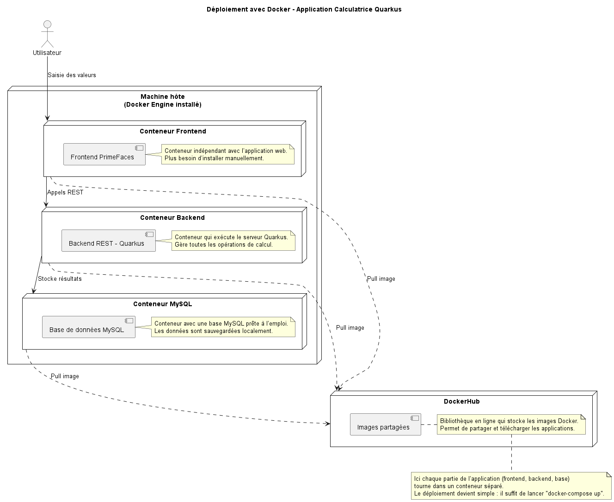
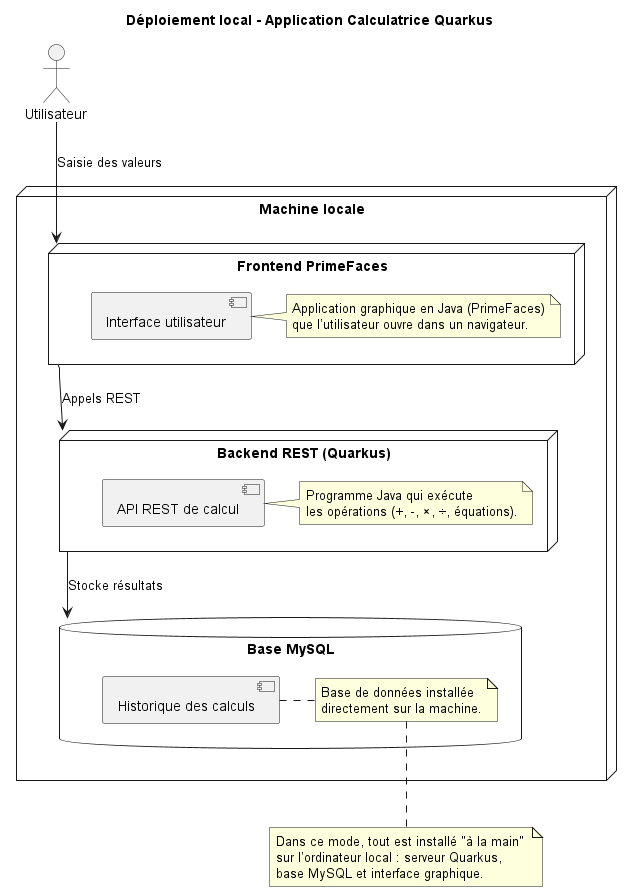
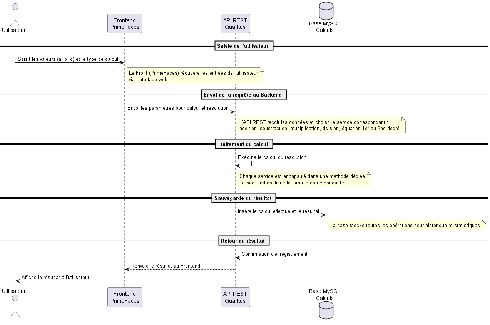

# Frontend Quarkus - Application Calculatrice

Ce dépôt contient le **frontend Quarkus avec PrimeFaces** pour l'application Calculatrice.  
Il fournit une interface web permettant aux utilisateurs d’effectuer des opérations mathématiques et de visualiser les résultats, tout en interagissant avec le **serveur Quarkus** via des services REST.

---

## Fonctionnalités du frontend

- **Interface utilisateur moderne** basée sur PrimeFaces.
- Champs de saisie pour les opérations :
  - Addition
  - Soustraction
  - Multiplication
  - Division
  - Équation du 1er degré
  - Équation du 2nd degré
- **Affichage des résultats** en temps réel.
- **Historique des calculs** récupéré depuis la base MySQL (via le backend).

---

## Diagrammes explicatifs

### 1️⃣ Diagramme de séquence - Interaction utilisateur
Montre le flux entre l’utilisateur, l’interface PrimeFaces et le serveur Quarkus.



---

### 2️⃣ Diagramme d’architecture
Représente l’interaction entre le frontend (PrimeFaces), le backend Quarkus et la base MySQL.



---

### 3️⃣ Aperçu de l’interface
Capture d’écran de l’application web.



---

## Instructions pour exécuter le frontend

### En local
1. Installer Java 21 et Maven.
2. Vérifier que le **serveur Quarkus backend** est en cours d’exécution.
3. Lancer le frontend :  
```bash
mvn quarkus:dev
